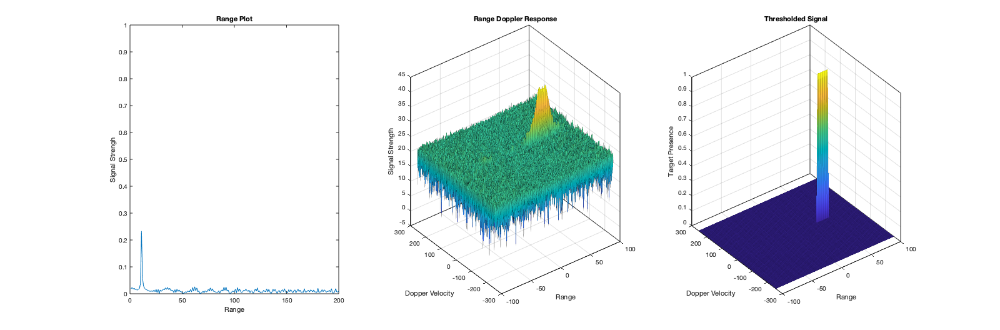

# Sensor Fusion: Radar Target Generation and Detection

This project aims to implement radar-based target detection for a FMCW radar system.

### **Radar Plots**


### **Implementation of 2D CFAR**

1. Created variable ```signal_post_thresholding``` and normalised RDM.
2. Designed a sliding window such that the CUT convolves over the normalised RDM with margins for training / guard cells.
3. Summed the signal noise across the training cells for each window location.
4. Calculated the mean noise level based on number of training cells.
5. Added a pre-determined offset to determine the threshold.
6. Compared the signal of the CUT with the threshold setting the value to zero if CUT < threshold, otherwise one.

### **Selection of Training / Guard Cells and Offset**

1. Tweaked number of training / guard cells as well as the offset values in order to remove spurious targets in normalised RDM.
2. Zeroed cells at the edges of the normalised RDM that did not fit within the prescribed sliding window.
